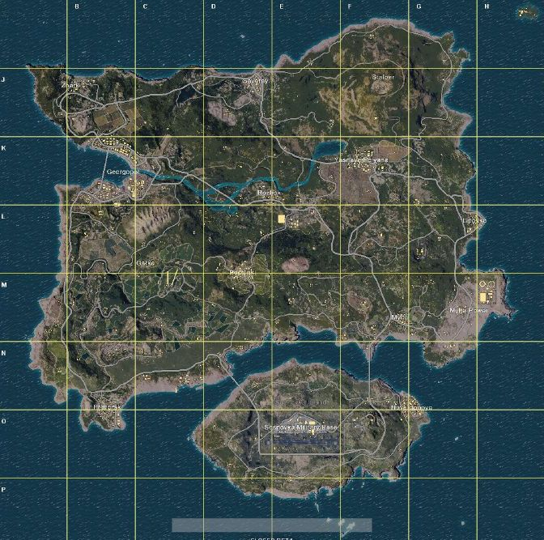

```{r include = F}
knitr::opts_chunk$set(include = TRUE, comment = NA, warning = FALSE, 
                      message = FALSE, cache = FALSE, fig.align = 'center')
```

```{r packages, include = F, cache = F}
library(pacman) # for loading packages
p_load(tidyverse, janitor, caret, lubridate, RColorBrewer, corrplot, factoextra)
```

# Overview

<figure>
  
  
  <figcaption><i>Left: A skilled sniper taking out a moving target. Right: A PUBG map.</i></figcaption>
</figure>

## Motivation

Battle royale games have surged in popularity in recent years. The premise of such games is as follows: players are dropped onto a fictional island and fight to be the last person standing. As they roam around the island, they loot for weapons and items crucial for their survival. Players can choose to join a game as a solo player or with a group of friends (4 players maximum). When playing solo, players are immediately eliminated when they are killed. However, in group play, killed individuals can be revived by their teammates. 

We are interested in building a prediction model for the popular battle royale game PUBG (PlayerUnknown's Battlegrounds). In PUBG, players not only have to worry about getting killed by other players, but they also have to stay within the shrinking "safe zone," which effectively forces players into contact with each other. Outside of the "safe zone," players take damage to their health at increasing rates. 

Through our analysis, we aim to understand what characterizes winning players or teams: How aggressive are the playing styles of the winners? Is it better to land in a densely or sparsely populated area? Do players who travel farther on the map tend to place higher or lower? Answers to such questions will be of high interest for the PUBG gaming community.

## Related Work

This project was inspired by a [Kaggle competition](https://www.kaggle.com/c/pubg-finish-placement-prediction):

> The team at PUBG has made official game data available for the public to explore and scavenge outside of "The Blue Circle." This competition is not an official or affiliated PUBG site - Kaggle collected data made possible through the PUBG Developer API. You are given over 65,000 games' worth of anonymized player data, split into training and testing sets, and asked to predict final placement from final in-game stats and initial player ratings.

We thought that it would serve as a good final project idea for this class, since there's a lot of potential in what we could do with the data. We wanted to build upon the Kaggle competition to develop a hopefully interesting analysis.

## Initial Questions

The main goal of this project is to predict a player's finish placement based on their in-game actions. Specifically, the three subquestions of interest are:

1. **Model Prediction Accuracy**: How well can we predict a player's finish placement?
2. **Feature Ranking**: What player actions or statistics are most predictive of their finish placement?
3. **Clustering**: Which playing styles are most successful?

# Data

The data comes from the Kaggle competition.

* **For TA use**: Run the code chunk below to download the data from the Dropbox link. This link is guaranteed to be available only during the grading period. 
* **For everyone else**: Join the Kaggle competition and run the shell script `download_data.sh`.

```{r download_data}
data.url <- paste0("https://www.dropbox.com/s/mp89gp57cz2dsc7/train_V2.csv.zip?dl=1")

if(!file.exists("./data/train_V2.csv.zip")){
  download.file(data.url, destfile = "./data/train_V2.csv.zip", mode = "wb")
}
```

```{r import_data}
# Warning: Large dataset (628 MB), will take a minute or so to read.
raw_dat <- read_csv("./data/train_V2.csv.zip")

clean_dat = raw_dat %>%
  clean_names() %>%
  drop_na(win_place_perc) # Drop rows without outcome variable
```


## Variables

Each row in the data contains one player's post-game stats. A description of all data fields is provided in `data/pubg_codebook.csv`. We will focus on the solo game mode (`match_type` is solo, solo-fpp, or normal-solo-fpp). The solo game mode constitutes about 16% of the data, with 720,386 observations. The outcome variable we are trying to predict is `win_place_perc`. 

```{r clean_data}
solo_dat <- clean_dat %>% 
  #sample_n(10000) %>%
  filter(match_type %in% c("solo", "solo-fpp", "normal-solo-fpp")) %>%
  select(-dbn_os, -assists, -revives, -group_id, -match_type, -team_kills) %>%        # Remove features that are not relevant to solo mode
  mutate(kill_points = ifelse(rank_points == -1 & kill_points == 0, NA, kill_points), # Following codebook explanations
         win_points = ifelse(rank_points == -1 & win_points == 0, NA, win_points), 
         rank_points = ifelse(rank_points == -1, NA, rank_points),
         id = as.factor(id), 
         match_id = as.factor(match_id)) %>%
  select(-kill_points, -win_points, -rank_points)    # Variables being deprecated
```

## Training and Test Set 

We are given a training set and a test set. The outcome variable for the test set will not be provided until the end of the Kaggle competition in Jan. 30th, 2019. Therefore, for the purposes of this project, we will only be using the provided training set. Due to computational costs, we will only use 100,000 observations (7% of the available data). Within this set, we will create our own "training" (60%), "validation" (20%), and "test" set (20%). For the rest of the document, the "training set" refers to the one we've created.

```{r train_test_split}
# Sample 100,000 observations
set.seed(1)
solo_dat = solo_dat %>%
  sample_n(100000)

# Split into train and test
train_ind = createDataPartition(y = solo_dat$win_place_perc, p = 0.6, list = F)
train_solo = solo_dat %>%
  slice(train_ind)
temp_solo = solo_dat %>%
  slice(-train_ind)

# Split into validation and test
test_ind = createDataPartition(y = temp_solo$win_place_perc, p = 0.5, list = F)
val_solo = temp_solo %>%
  slice(-test_ind)
test_solo = temp_solo %>%
  slice(test_ind)
```

```{r}
glimpse(train_solo)
```

# Exploratory Data Analysis

In the training set, we have `r n_distinct(train_solo$id)` players and `r n_distinct(train_solo$match_id)` matches. 

```{r prop_data}
# Compute proportions
prop_data = train_solo %>% 
  group_by(match_id, max_place, match_duration) %>% 
  count() %>%
  ungroup() %>%
  mutate(prop = n/max_place,
         remove_game = prop > 1)

# Games with proportion greater than 100%
prop_over_100 = prop_data %>%
  summarize(prop_n = sum(prop > 1),
            prop_games = prop_n/n())

# Histogram
prop_data %>%
  ggplot(aes(x = prop)) + 
  geom_histogram(bins = 30, color = 'white') +
  labs(title = "Proportion of players we have data for in a game",
       x = "Proportion",
       y = "Count") +
  theme_minimal()

# Remove games with proportion greater than 100%
remove_match_ids = prop_data %>%
  filter(remove_game) %>%
  pull(match_id)

train_solo = train_solo %>%
  filter(!(match_id %in% remove_match_ids))
```

For most games, we have between 70% to 90% of the players' data, using `max_place` (the worst placement for which we have data) as a proxy for total number of players. For `r prop_over_100$prop_n` games (`r round(prop_over_100$prop_games*100, 2)`% of all games), we have more observations than `max_place`, which is not possible. Thus, we excluded these games from our analysis.

## Distribution of Features by Finish Percentile

We first explored the distribution of each feature by the final finish percentile. Players were first grouped into the 0-19th, 20th-39th, 40th-59th, 60th-79th, or 80th-100th percentile finish. Then we plotted the density of features by percentile groups. Note that due to extreme outliers, we excluded the highest 1% of many of the features for clearer visualizations.

```{r plot_dist_of_features_by_percentile, fig.width = 10, fig.height = 12}
filter_vars = c("boosts", "damage_dealt", "headshot_kills", "heals", "kills", "longest_kill", "ride_distance", "swim_distance", "walk_distance", "weapons_acquired")
train_solo %>% 
  filter_at(vars(filter_vars), all_vars(. < quantile(., 0.99, na.rm = T))) %>%   # Remove outliers
  rename_at(vars(filter_vars), ~ sapply(filter_vars, function(str) paste0(str, "*"))) %>% # Mark variables for which we removed outliers with asterisk features
  mutate(win_place_cat = floor(win_place_perc / 0.2),
         win_place_cat = ifelse(win_place_cat == 5, 4, win_place_cat),
         win_place_cat = as.factor(win_place_cat)) %>%
  gather("feature", "value", -match_id, -match_duration, 
         -id, -win_place_perc, -win_place_cat) %>%
  ggplot(aes(x = value, group = win_place_cat, color = win_place_cat)) +
  facet_wrap(feature ~., scales = "free") +
  geom_density() +
  labs(title = "Distribution of Features by Finish Percentile", 
       caption = "* Removed outliers (> 99th percentile) from this feature's density plot",
       x = "Value of Features", y = "Density", color = "Percentile") +
  scale_color_manual(labels = c("0-19", "20-39", "40-59", "60-79", "80-100"),
                     values = brewer.pal(5, "OrRd")) +
  theme_minimal() + 
  theme(axis.text.x = element_text(angle = 90, hjust = 1))
```
  
**Note: Need to resolve warning (non-finite values)**

Some interesting relationships between the features and the finish percentile:

- **Use of Items** (`boosts`, `heals`, and `weapons_acquired`): Players who finish higher tend to have used more boosts and healing items, and acquired more weapons. This is expected since they stayed in the game for a longer period and have more time to collect and use items. However, it would be interesting to explore which of these features is most predictive of a high finish placement.

- **Kills & Damage** (`damage_dealt`, `kill_place`, and `kills`): Players who finish higher tend to have more kills. They also tend to have dealt more damage. However, in the top finishing group, there is a wide variety in how much damage they inflict. This could potentially indicate strategies that differ in their level of aggressiveness during the course of the game but are similarly successful in achieving a high placement. 

- **Distance Traveled** (`walk_distance`, `swim_distance`, and `ride_distance`): Players who finish higher tend to have walked farther. This is likely because they simply survive longer and are force to travel to stay in the safe zone, whereas players who die early don't get a chance to travel very far. Both swimming and riding in vehicles are rare occurrences, though it appears that players who finish higher also tend to do more of both.

(Additional notes to ourselves regarding some features of the data we might want to look at):

* `kill_place`, `kill_points`, `kills`, and `win_points` follow bimodal distributions. This may reflect the play-styles of each player. Players who land in populated areas are more likely to encounter other players, resulting in a higher porbability of dying or a larger number of kills if the player survives. Thus, we can partition players in the 10th percentile finish into two categories: a skilled player who but dies early due to dropping in a populated location, but due to their skill acquires a large number of kills or a less-skilled player who dies early due to lack of skill despite dropping in a less populated location. 
* Some features look highly skewed (e.g. `longest_kill`, `ride_distance`, `swim_distance`, `ride_distance`, etc.). We may want to log-transform these variables in our model building. 
* The `num_groups` density plots suggest that in games where we have little data, we tend to have data on the winners. Thus, there may be some imbalance in the data we will need to either adjust for to ensure that our model doesn't overestimate finish percentile. 
* `rank_points`, `win_points` and `kill_points` are external characteristics (from previous games) that attempt to characterize the skill level of a player. These distributions are bimodal which may reflect the extremes of the two playstyles described above. It seems that `kill_points` has more predictive value of finish percentile as the right-shift is more distinct by finish percentage category than `rank_points`. Interestingly, `rank_points` suggests that prior-game ranks do not have a large impact on the final placement in a game (though there is a note int the `pubg_codebook.csv` file that this metric is deprecated). This makes sense since in-game variables like drop location, loot, and circle movement can affect how likely an individual is to win. 

## Correlation Plot

Statistics related to `kills` seem to be well correlated with finish percentile. Additional duration of game does not seem to be strongly correlated with many of the in-game features such as `kills`, `walk_distance`, etc. 

```{r corr_plot, fig.width = 10, fig.height = 12}
corr_matrix = train_solo %>% 
  select(-id, -match_id) %>% 
  cor()

corrplot(corr_matrix, method = "color", type = "upper")
```

# Prediction Models & Feature Ranking

In this section, we aim to answer our first two questions:

1. **Model Prediction Accuracy**: How well can we predict a player's finish placement?
2. **Feature Ranking**: What player actions or statistics are most predictive of their finish placement?

To answer these questions, we will fit the following models, test our model on an independent test set, and examine feature importance scores:

1. Linear regression (to constrain outcome, need to use a GLM with beta or binomial distrib)
2. Elastic net regression
3. Random forest

In training our models, unless stated otherwise, we will include all features except for the match ID and player ID, since neither feature is going to generalize for predicting new games, which is what we are interested in. 

## Linear Regression

First, we fit a linear regression model with 5-fold cross-validation. Since the win place percentage is a value beteen 0 and 1, we apply a log transformation (adding 1 to ensure all values are defined), so that it better fulfills the assumption that $y$ is a continuous variable on the real line. However, this still doesn't guarantee that the predicted values will be between 0 and 1, so we constrain the predicted value to be 0 if it is negative and 1 if it is above 1. 

```{r lm}
set.seed(1)
tc = trainControl(method = "cv", number = 5)

# Fit linear model using step-wise model selection using AIC
lm_model = train(log(win_place_perc + 1) ~ . - match_id - id, data = train_solo, 
                 method = "lm", trControl = tc)
print(lm_model)

# Save predictions
predictions_solo = data.frame(win_place_perc = val_solo$win_place_perc,
                              lm_pred = exp(predict(lm_model, val_solo)) - 1) %>%
  mutate(lm_pred = case_when(lm_pred < 0 ~ 0,
                             lm_pred > 1 ~ 1,
                             lm_pred >= 0 & lm_pred <= 1 ~ lm_pred)) # Constrain values to [0,1]

# Plot predicted vs true values
predictions_solo %>%
  ggplot(aes(x = lm_pred, y = win_place_perc)) +
  geom_point(alpha = 0.5, size = 0.1) +
  labs(title = "Predicted Versus Actual Win Place Percentage (Linear Regression)", 
       x = "Predicted Win Place Percentage", y = "Actual Win Place Percentage") +
  theme_bw()
```

## Elastic net regression

As we noted earlier in the data exploration, some of the features are highly correlated and/or seem to provide little signal (such as distance traveled). To solve these issues, we implement elastic net regression which uses a ridge-regression-like penalty to adjust for correlated features and lasso penalty to shrink non-informative features to zero. Using 5-fold cross-validation in the training set, we tune regularization hyperparameters. 

```{r lasso}
set.seed(1)
# Fit lasso_model using glmnet
lasso_model = train(log(win_place_perc + 1) ~ . - match_id - id, data = train_solo, 
                    method = "glmnet", trControl = tc)
print(lasso_model)
#coef(lasso_model$finalModel, lasso_model$bestTune$lambda)

# Add predictions to df
predictions_solo = predictions_solo %>%
  mutate(lasso_pred = exp(predict(lasso_model, val_solo)) - 1,
         lasso_pred = case_when(lasso_pred < 0 ~ 0,
                                lasso_pred > 1 ~ 1,
                                lasso_pred >=0 & lasso_pred <= 1 ~ lasso_pred)) # Constrain values to [0,1]

# Plot predicted vs true values
predictions_solo %>%
  ggplot(aes(x = lasso_pred, y = win_place_perc)) +
  geom_point(alpha = 0.5, size = 0.1) +
  labs(title = "Predicted Versus Actual Win Place Percentage (Elastic Net)", 
       x = "Predicted Win Place Percentage", y = "Actual Win Place Percentage") +
  theme_bw()
```

## Random Forest

To account for correlation between features, another option is to use a random forest model. Ensemble methods like random forest are also known to generally perform better than regression models. Due to computational costs, however, we make the following choices:

1. Train the random forest model on 10,000 observations (as opposed to 60,000 observations).
2. Use only the top 10 features (out of 19 features) determined by elastic net regression.
3. Use 100 trees in the random forest.

Again with 5-fold cross-validation, we tune hyperparameters for random forest.

```{r rf}
set.seed(1)
# Warning: Takes a while to run (~3 minutes)
imp_features = varImp(lasso_model$finalModel) %>%  
  mutate(variable = rownames(.)) %>%
  arrange(desc(Overall)) %>%
  slice(1:10) %>%
  pull(variable)

rf_model = train(as.formula(paste("win_place_perc ~ ", paste(imp_features, collapse = "+"))), 
                 data = sample_n(train_solo, 10000), method = "rf", ntree = 100, importance = T, trControl = tc)
print(rf_model)

# Add predictions to df
predictions_solo = predictions_solo %>%
  mutate(rf_pred = predict(rf_model, val_solo))

# Plot predicted vs true values
predictions_solo %>%
  ggplot(aes(x = rf_pred, y = win_place_perc)) +
  geom_point(alpha = 0.5, size = 0.1) +
  labs(title = "Predicted Versus Actual Win Place Percentage (Random forest)", 
       x = "Predicted Win Place Percentage", y = "Actual Win Place Percentage") +
  theme_bw()
```


## Feature Ranking

Which features are most predictive? With the generic `varImp` function, we can compare the relative importance of features. The meaning of `varImp` for each model is:

1. Linear regression: absolute value of the t-statistic
2. Elastic net: absolute value of coefficients
3. Random forest: importance scores, which corresponds to the decrease in out of bag accuracy when each feature is randomly permuted

```{r}
# Table of variable importance scores
lm_imp = varImp(lm_model$finalModel) %>%        # absolute value of t-statistic
  mutate(variable = rownames(.)) %>%
  arrange(desc(Overall)) %>%
  rename(lm_imp = Overall)

lasso_imp = varImp(lasso_model$finalModel) %>%  # absolute value of coefficients
  mutate(variable = rownames(.)) %>%
  arrange(desc(Overall)) %>%
  rename(lasso_imp = Overall)

rf_imp = varImp(rf_model$finalModel) %>%        # importance scores
  mutate(variable = rownames(.)) %>%
  arrange(desc(Overall)) %>%
  rename(rf_imp = Overall)

imp = full_join(lm_imp, lasso_imp, by = "variable") %>%
  full_join(., rf_imp, by = "variable") %>%
  select(variable, everything()) %>%
  mutate_at(vars(lm_imp:rf_imp), function(x){scale(x, center = F)}) %>%     # Normalize importance scores within models
  drop_na()                                 # Drop features not used by random forest
  
imp$variable = factor(imp$variable, levels = imp$variable[order(imp$rf_imp, decreasing = T)])

# Note: for some reason, can't do this step in mutate:
imp = imp %>%
  gather(model, importance, -variable)

# Make a plot for variable importance
imp %>%
  ggplot(aes(x = variable, y = importance, fill = model)) +
  geom_col(position = "dodge") + 
  labs(title = "Feature Ranking",
       x = "Feature",
       y = "Importance (Scaled)",
       fill = "Model") +
  scale_fill_manual(labels = c("Elastic Net", "Linear", "Random Forest"),
                    values = c("#999999", "#E69F00", "#56B4E9")) +
  theme_bw() + 
  theme(axis.text.x = element_text(angle = 45, hjust = 1))
```

There is not much agreement in the features that each model regards to be important. This may be due to highly correlated features; for example, `kill_place` and `kill_streaks` are highly correlated and while the former is rated as highly important by the linear regression and random forest, the latter is rated as highly important by elastic net regression. For now, we will postpone the question of feature importance and continue investigating this question in the dimension reduction and clustering section.

## Comparison of Models

We will compare our models with the following metrics on the validation set:

1. **Mean absolute error (MAE)**: Represents the average absolute deviation. 
$$MAE = \frac{\sum_{i=1}^n |\hat{y}_i - y_i|}{n}$$

2. **Self-defined accuracy metric (SDAM(x))**: This metric is a function of a cutoff value $x$. If the predicted outcome is within $x\%$ of the actual win place percentage, we classify it as a "correct" prediction. Otherwise, it is an incorrect prediction.  
$$SDAM(x) = \frac{\sum_{i=1}^n \mathbb{1}_{|\hat{y}_i - y_i| <= x}}{n}$$

3. **Classification of Winners**: We can compute the ROC curve by turning our predictions into a classification problem. Given a predicted win place percentage, we classify the player as a winner if its predicted value is less than a cutoff value $x\%$. For different cutoff values, we can then compute the sensitivity (true positive rate, or the proportion of actual winners we classify as such) and specificity (true negative rate, or the proportion of actual losers we classify as such).

```{r}
predictions_solo = predictions_solo %>%
  mutate(lm_ae = abs(lm_pred - win_place_perc),
         lasso_ae = abs(lasso_pred - win_place_perc),
         rf_ae = abs(rf_pred - win_place_perc))

# Summarize metrics
metrics_solo = predictions_solo %>%
  mutate(lm_correct = lm_ae <= 0.05,
         lasso_correct = lasso_ae <= 0.05,
         rf_correct = rf_ae <= 0.05) %>%
  summarize(lm_mae = mean(lm_ae),
            lm_sdam = mean(lm_correct),
            lasso_mae = mean(lasso_ae),
            lasso_sdam = mean(lasso_correct),
            rf_mae = mean(rf_ae),
            rf_sdam = mean(rf_correct)) %>%
  gather() %>%
  separate(key, c("model", "metric"))

# Plot MAE
metrics_solo %>%
  filter(metric == "mae") %>%
  ggplot(aes(x = model, y = value, label = round(value, 3))) +
  geom_col() +
  geom_label() +
  labs(title = "Comparison of MAE", x = "Model", y = "MAE") +
  scale_x_discrete(labels = c("Elastic Net", "Linear", "Random Forest")) +
  theme_bw()

# Plot SDAM
cutoff = seq(0, 0.5, by = 0.01)
prop_lm = sapply(cutoff, function(x) mean(predictions_solo$lm_ae < x))
prop_lasso = sapply(cutoff, function(x) mean(predictions_solo$lasso_ae < x))
prop_rf = sapply(cutoff, function(x) mean(predictions_solo$rf_ae < x))

data.frame(cutoff = rep(cutoff, 3), 
           prop = c(prop_lm, prop_lasso, prop_rf),
           model = rep(c("Linear", "Elastic Net", "Random Forest"), each = length(cutoff))) %>%
  ggplot(aes(x = cutoff, y = prop, color = model)) + 
  geom_point() +
  geom_line() +
  geom_vline(xintercept = 0.05, linetype = "longdash", color = "slategray") +
  annotate(geom = "text", x = 0.05, label="SDAM(0.05)", y = 0.8, colour = "slategray", angle = 90, vjust = -1.1) +
  labs(title = "Comparison of SDAM",
       subtitle = "Proportion of Predictions Within x% of Actual Win Place Percentage",
       x = "|Predicted - Actual Win Place Percentage|",
       y = "SDAM",
       color = "Model") +
  theme_bw()

# Plot ROC
```

From the above plots, we can see that random forest performs best on both metrics. This is despite the restrictions we had to place in order to run the random forest model in a reasonable amount of time. Its MAE is 0.054, which means that on average, the predicted win place percentage is 0.057 off from the true win place percentage. Its SDAM is consistently higher than the SDAM for linear regression or elastic net regression. For example, its SDAM(5) is 0.604, which means that for 60.4% of observations in our validation set, the predicted value is within 5% of the true win place percentage.

## Performance on Test Set

As we have found that the random forest model has the highest accuracy in the training set, we validate our results on an independent test set. 

```{r lm_test}
pred_test = data.frame(rf_test_pred = predict(rf_model, test_solo)) %>%
  mutate(rf_test_ae = abs(rf_test_pred - test_solo$win_place_perc),
         rf_test_correct = rf_test_ae <= 0.05)

# Plot percent of observations with predictions falling within x% of true outcome
cutoff = seq(0, 0.5, by = 0.01)
prop_test = sapply(cutoff, function(x) mean(pred_test$rf_test_ae < x))
data.frame(cutoff = rep(cutoff, 2), 
           prop = c(prop_rf, prop_test),
           set = rep(c("Validation", "Test"), each = length(cutoff))) %>%
  ggplot(aes(x = cutoff, y = prop, color = set)) + 
  geom_point() +
  geom_line() +
  geom_vline(xintercept = 0.05, linetype = "longdash", color = "slategray") +
  annotate(geom = "text", x = 0.05, label="SDAM(0.05)", y = 0.8, colour = "slategray", angle = 90, vjust = -1.1) +
  theme_bw() +
  labs(title = "Comparison of SDAM",
       subtitle = "Proportion of Predictions Within x% of Actual Win Place Percentage",
       x = "|Predicted - Actual Win Place Percentage|",
       y = "SDAM",
       color = "Model") +
  theme_bw()

pred_test_metrics = pred_test %>%
  summarize(rf_test_mae = mean(rf_test_ae),
            rf_test_sdam = mean(rf_test_correct))
```

On the test set, random forest has a MAE of `r round(pred_test_metrics$rf_test_mae, 3)` and a SDAM(5) of `r round(pred_test_metrics$rf_test_sdam, 3)`, which is similar to what we saw in the validation set. We can also see in the above plot that the random forest model performs equally well in the test set as in the validation set.

## Summary

**Best-performing model: Random forest**

We use three different models to predict the win place percentage: linear regression, elastic net regression, and random forest. Using mean absolute error (MAE) and a similar, self-defined accuracy metric (SDAM) quantifying the proportion of predictions that fall within 5% of the true win place percentage, we found that the random forest model performed best using 5-fold cross validation on the training set. On an independent test set, we achieved a MAE of `r round(pred_test_metrics$rf_test_mae, 3)` and a SDAM of `r round(pred_test_metrics$rf_test_sdam, 3)`.

**Higher predictive accuracy for top players**

With the random forest model in particular, we can see from its figure of predicted vs actual values that our predictions are more accurate for players with higher placements. This makes sense since there should be increasingly higher demands on skill the higher you place and therefore more signal in the data. In other words, the difference in skill between a player who places 60 vs a player who places 90 out of 100 is likely much smaller than the difference between a player who places 1 vs a player who places 30 out of 100. As a result, we can more accurately distinguish between places the higher you place. 

# Dimension reduction and clustering

We can try the following and see which one gives us a better story:

1. We can do PCA, plot observations along principal components, color points by outcome, and then try to interpret the top principal components in terms of the features.

2. Manually summarize the features into something like the 3-4 categories described in the exploratory data analysis section, i.e. engineer a summary feature for "damage/kills", another summary feature for "distance travelled." Consult correlation plot and PCA plot to get good groupings as well. Then plot observations along these summary features and color points by outcome. This is basically the same idea as PCA except we already have a story in place for what the components mean.

## Principal Components Analysis

```{r pca}
set.seed(1)
# PCA
X = train_solo %>%
  select(-win_place_perc, -id, -match_id) %>%
  as.matrix()

pc = prcomp(X, center = T, scale = T)

# Plot eigenvalues (percentage of variances explained by each principal component)
fviz_eig(pc)

# Plot cumulative variance explained by the first k PCs
data.frame(cumvar = cumsum(pc$sdev^2/sum(pc$sdev^2))) %>%
  ggplot(aes(x = 1:length(cumvar), y = cumvar*100)) +
  geom_point() +
  geom_line() + 
  labs(title = "Cumulative Variance Explained by the First K PCs", 
       x = "K", y = "Percent of Variance Explained") +
  theme_bw()

# Plot features in terms of the first two principal components
# Positively correlated features point in the same direction, negative correlated features point to opposite direction
fviz_pca_var(pc,
             col.var = "contrib", # Color by contributions to the PC
             gradient.cols = c("#00AFBB", "#E7B800", "#FC4E07"),
             repel = TRUE     # Avoid text overlapping
             )
```

The first principal component explains much of the variance we see in our features (29.6%), while the second to sixth principal component all explain between 5 to 10%. In the second plot, we can observe each feature's contribution to the first two principal components and their correlations.

1. **PC 1**: The first principal component comprises of features related to damage and kills, primarily the features `kills`, `kill_place`, `damage_dealt`. To a lesser extent, features like `damage_dealt`, `longest_kill`, `headshot_kills`, `boosts`, and `heals` also exhibit contribution primarily to the first principal component. 

2. **PC 2**: The second principal component is characterized by details related to the match setting, i.e. `num_groups` and `max_place`.

Remaining features like `road_kills`, `vehicle_destroys`, `ride_distance` do not contribute much to either of the first two principal components. We should investigate if they do to the third principal component.

```{r pca_points}
# Plot points on principal components 1 and 2 
data.frame(PC1 = pc$x[,1], PC2 = pc$x[,2]) %>%
  ggplot(aes(PC1, PC2, color = train_solo$win_place_perc)) +
  geom_point(alpha = 0.5) +
  labs(title = "Win Place Percent of Training Data by PC1 and PC2",
       color = "Win Place Percent") +
  theme_bw()

# Plot point on principal components 1 and 3
data.frame(PC1 = pc$x[,1], PC3 = pc$x[,3]) %>%
  ggplot(aes(PC1, PC3, color = train_solo$win_place_perc)) +
  geom_point(aes(alpha = 0.5)) +
  labs(title = "Win Place Percent of Training Data by PC1 and PC3",
       color = "Win Place Percent") +
  guides(alpha = F) +
  theme_bw()

# Plot point on principal components 2 and 3
data.frame(PC2 = pc$x[,2], PC3 = pc$x[,3]) %>%
  ggplot(aes(PC2, PC3, color = train_solo$win_place_perc)) +
  geom_point(alpha = 0.5) +
  labs(title = "Win Place Percent of Training Data by PC2 and PC3",
       color = "Win Place Percent") +
  theme_bw()
```

Our outcome feature `win_place_perc` is pretty well explained by the first principal component. 

To-do: 
1. Investigate why plotting PC3 and PC2 lead to clusters.
2. Principal components regression (using 4-5 PCs). How does it compare to our earlier models?

```{r}
# method = "pcr"

```


## K-means

To-do:
1. K-means clustering. It seems to me like aggressive playing styles are highly predictive for winning, but we can investigate whether there are other types of successful playing styles.

## Summary


# Narrative and Summary
